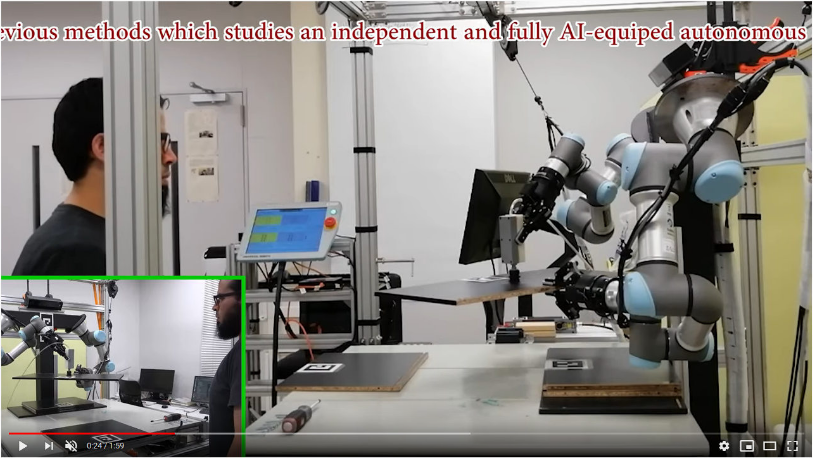

# Human-robot Collaborative Assembly
This is the second half of my study on the Human-Robot collaborative assembly framework. The first one is described here without deep technicalities. It describes how the robot capabilities of manipulating heavy objects is enhanced through constraint manipulation with relaxation calculated based on every manipulated object. 

## The big picture
The second module presented here relates to how to plan robot-to-human handover poses that are both comfortable for the human, and reachable for the robot. The process happens in the order described by the next figure, and the details come next.

## Handover planning
The pecific goal here is take every single workpiece (board in the cabinet to be assembled) and plan a handover pose for it.

### The first step
The story of the planning starts with knowing how the final assembly is like, and hence the pose of every work piece in this assembly. Let’s take the side board, highlighted in yellow in the above figure as an example. 

### The second step
Multiple samples of the potential handover poses are defined and distributed with respect to the assembly pose of the target workpiece. The samples are shown in grey in the above figure. 

### The third step
The samples are checked for being both reachable, and comfortable to the human. The reachability is decided using inverse kinematics, and the comfortableness is estimated using the inverse of the condition number of the human arm (similar in principle to the manipulability defined by Yoshikawa sensei). The set of reachable, comfortable poses are shown in orange. 

### The fourth step
The set of the human reachable, comfortable poses are then tested for being reachable to the robot. In deed, a check for shared grasps for dual-arm manipulation is carried out here (have a look below for a bit more of details). The subset of poses that satisifies are both human comfortable and robot reachable. This subset is shown in dark orange.

### The fifth step
The satisfactory poses from the prevous step are ordered according to how far every they are from the target assembly pose. The nearest comfortable pose is selected as the handover pose. The selected pose is shown in red with the approximated human grasp and the exact robot grasp.

## Would like some interesting details?
For a bit of the internals of the above described flows, the predefined robot and human poses for one of the objects are shown below. If we break it down, then the above search is about finding some hands (robot, and human) that are connectable to the arms at each pose of the workpieces.

* **How is the robot-to-robot handover decided?**

For this we need to find some shared grasps at two different poses of the object. This comes in the above-mentioned fourth step. The green arm below indicates a shared grasp at two different handover poses. The start is in blue and the goal in red.

* **How to connect a robot-to-robot handover and robot-to-human handover to get the task done?**

As I mentioned above, the story starts with the human (to make the handover pose comfortable) and then comes the robot. If we connect the first piece of the story to the above robot-to-robot handover, it would appear as follows for (a) example shown above. This is the whole lovely story! 

## Practical result for next-generation manufacturing
The result of this module is given to the [motion planning module]() to plan the robot motion that takes the object from the table to the handover pose. The knowledge of the object poses is calculated by [this]() vision module. The following is the result of fully assembling a cabinet with the described approach.

The details of this project are described in [this paper](https://ieeexplore.ieee.org/document/9044335). This module was integrated in my lab's robotics development environemt as a method for 3D pose estimation. 

## Contact
If you are interested in the presented work/ideas, or if you have any questions, feel free to connect with me on [LinkedIn](https://www.linkedin.com/in/mohraess). We can disuss about this project and other interesting projects.

